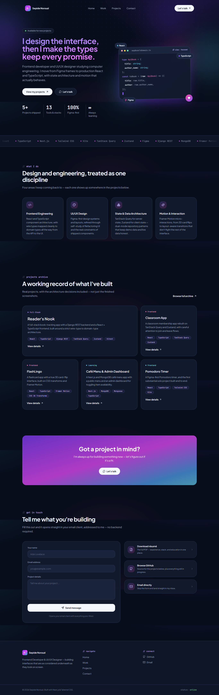

<div align="center">

# ✦ Developer Portfolio Template

**A light-mode, animation-rich portfolio built with Next.js, TypeScript, Tailwind CSS and Framer Motion.**
Edit one data file, swap in your projects, and ship.


</div>

<br />



<br />

## About

This repository is the source code for a complete developer portfolio website. It is designed as a
starting point: every piece of content (your name, headline, stats, skills, and projects) lives in a
single file, so you can make it yours without digging through components.

The design is intentionally "tech-coded": soft violet / pink / cyan accents on a light canvas, a
monospace voice for anything code-flavored, and a hero built around an animated code-editor window.

## Features

- **Single-page home** with hero, scrolling tech-stack ticker, services, project grid, call-to-action and contact sections
- **Multi-page routing** with a full projects archive (`/projects`) and a statically generated detail page for every project (`/projects/[slug]`)
- **Filter and search** on the archive page by category or tech stack
- **Animated hero** with a typed code-editor illustration, floating tech chips and drifting gradient blobs
- **Micro-interactions**: magnetic buttons, cursor-following spotlight on cards, count-up stats, scroll-triggered reveals, an infinite marquee, a scroll-progress bar and an ambient cursor glow
- **Route transitions** via the App Router `template.tsx`
- **Working contact form** with zero backend: it opens the visitor's email client with the message pre-filled
- **Responsive** from small phones to wide desktops, with a slide-down mobile menu
- **Accessible motion**: animations respect `prefers-reduced-motion`
- **SEO-ready** metadata per page and a custom 404
- **Type-safe content**: projects, services and site config are typed in `src/lib/types.ts`

## Tech stack

| Layer      | Technology                                                                            |
| ---------- | ------------------------------------------------------------------------------------- |
| Framework  | [Next.js 14](https://nextjs.org/) (App Router)                                        |
| UI library | [React 18](https://react.dev/)                                                        |
| Language   | [TypeScript](https://www.typescriptlang.org/)                                         |
| Styling    | [Tailwind CSS 3](https://tailwindcss.com/) with a custom theme, keyframes and shadows |
| Animation  | [Framer Motion](https://www.framer.com/motion/) plus CSS keyframes for ambient loops  |
| Icons      | [Lucide React](https://lucide.dev/)                                                   |
| Utilities  | `clsx` and `tailwind-merge` (via a `cn()` helper)                                     |
| Fonts      | Plus Jakarta Sans and JetBrains Mono (Google Fonts)                                   |

## Getting started

### Prerequisites

- **Node.js 18.17 or newer** (Node 20 LTS recommended). Check with `node -v`.
- npm (bundled with Node.js)

### Installation

```bash
# 1. Clone the repository
git clone https://github.com/SepideNorouzi/portfolio-base.git
cd portfolio-base

# 2. Install dependencies
npm install

# 3. Start the dev server
npm run dev
```

Open [http://localhost:3000](http://localhost:3000) and the page hot-reloads as you edit.

No environment variables or API keys are required.

### Scripts

| Command         | What it does                                  |
| --------------- | --------------------------------------------- |
| `npm run dev`   | Starts the development server with hot reload |
| `npm run build` | Creates an optimized production build         |
| `npm run start` | Serves the production build                   |
| `npm run lint`  | Runs ESLint                                   |


## Project structure

```
.
├── public/
│   └── favicon.svg
└── src/
    ├── app/
    │   ├── layout.tsx              Root layout: fonts, navbar, footer, ambient effects
    │   ├── page.tsx                Home page
    │   ├── template.tsx            Per-route fade-in transition
    │   ├── not-found.tsx           Custom 404
    │   ├── globals.css             Base styles, scrollbar, utility classes
    │   └── projects/
    │       ├── page.tsx            Archive with category + search filtering
    │       └── [slug]/page.tsx     Statically generated project detail pages
    ├── components/
    │   ├── layout/                 Navbar, footer, scroll progress, cursor glow
    │   ├── sections/               Hero, marquee, services, projects grid, CTA, contact
    │   ├── ui/                     Button, glow card, magnetic wrapper, tag, reveal, stat chip
    │   ├── project-card.tsx        Shared project card
    │   └── projects-filter.tsx     Client-side filter for the archive
    └── lib/
        ├── data.ts                 All site content lives here
        ├── types.ts                Shared TypeScript types
        └── utils.ts                cn() helper and accent-color lookup
```


## License

Released under the [Apache License](./LICENSE).

---

<div align="center">

Built by [Sepide Norouzi](https://github.com/SepideNorouzi)

</div>
